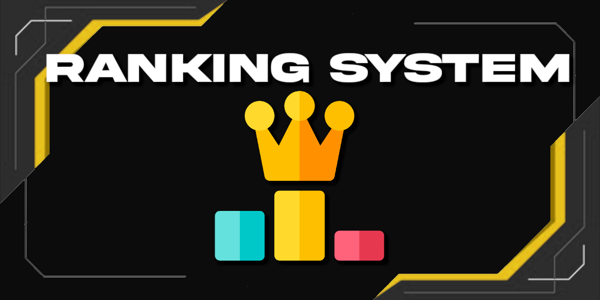

# Leveling-Up-Bot

## Overview

The Leveling-Up-Bot is a Discord bot designed to encourage Discord users to engage more actively in chat conversations. It offers various incentives and rewards to users based on their chat activity, allowing them to earn coins and purchase premium memberships and other goodies.

## Features

- **Engagement Incentives**: The bot motivates users to stay engaged on the Discord platform by setting chat goals and providing rewards for achieving them.

- **Coin System**: Users earn coins for participating in chat conversations. These coins can be used to unlock premium memberships and perks.

- **Premium Memberships**: Users can purchase premium memberships using their earned coins, granting them access to exclusive features and benefits.

- **Customizable Goals**: Administrators can customize chat goals and rewards to suit the community's preferences.

## Getting Started

### Prerequisites

- **Discord Account**: You must have a Discord account to add the bot to your server.

- **Server Owner/Admin Permissions**: You need to be the owner or have administrative permissions on the server where you want to add the bot.

### Adding the Bot to Your Server

1. Visit the [Leveling-Up-Bot Dashboard](https://www.levelupbot.com/dashboard) to access bot management features.

2. Click "Add to Server" and select the server where you want to add the bot.

3. Follow the on-screen instructions to configure bot permissions and add it to your server.

### Bot Commands

- `!help`: Display a list of available bot commands and their descriptions.

- `!checkcoins`: Check your current coin balance.

- `!buy <item>`: Purchase a premium membership or perk using your coins.

### Customization

Administrators can customize the bot's behavior, including chat goals, rewards, and premium membership benefits, through the bot's dashboard.

## Usage

1. After adding the bot to your server, invite your community members to participate in chat conversations.

2. Users will earn coins as they chat. They can check their coin balance using `!checkcoins`.

3. Achieving chat goals will earn users more coins.

4. Users can use their coins to purchase premium memberships and other perks by using the `!buy` command.

## Contributing

We welcome contributions from the community! If you have suggestions, bug reports, or would like to contribute code, please see our [Contributing Guidelines](CONTRIBUTING.md).

## License

This project is licensed under the [MIT License](LICENSE).

## Acknowledgments

We would like to thank the Discord community for their support and feedback in the development of this bot.

For any inquiries or issues, please contact us at [support@levelupbot.com](mailto:support@levelupbot.com).

Enjoy using the Leveling-Up-Bot and happy chatting!

---

*Note: Replace "bot_logo.png" and "bot_banner.png" with actual images if you have any.*

